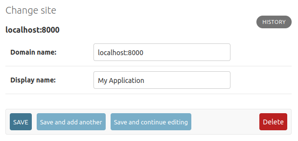
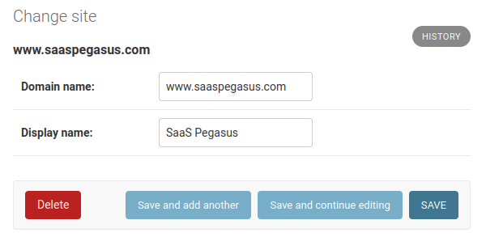

# Settings and Configuration

This section describes some of the settings and configuration details you can change inside Pegasus.

## Settings and environment files

Pegasus uses environment variables and `django-environ` to manage settings.
You *can* modify values directly in `settings.py`, but the recommended way to modify any setting
that varies across environments is to use a `.env` file.

Out-of-the-box, Pegasus will include multiple `.env` files for your settings:

**`.env` is for development in either a native or a Docker-based environnment.**
It will be picked up by default if you run `./manage.py runserver` or `docker compose start`.
If you need to swap between these environments you might need to modify a few variables in this file---in
particular the database and redis URLs.

The `.env` is typically not checked into source control (since it may include secrets like API keys),
so is included in the `.gitignore`.

**`.env.example` is an example file.**
It is not used for anything, but can be checked into source control so that
developers can use it as a starting point for their `.env` file.

Projects downloaded as zip files will include a `.env` file, but projects
created or pulled from Github will typically only include a `.env.example` file,
so you will need to copy this file locally to run your development server.

*Note: Pegasus versions prior to 2024.3 also included a `.env.docker` file.
This has been merged with the `.env` file.*

### Settings environment precedence

Most settings are configured in the form:

```python
SOME_VALUE = env('SOME_VALUE', default='')
```

As mentioned above, *it is recommended to set these values in your environment / `.env` file*,
which will always work as expected.

The environment takes precedence over the default if it's set---even if it is set to an empty value.
This can lead to confusing behavior.

For example, if in your `.env` file you have this line:

```
SOME_VALUE=''
```

And in your `settings.py` you provide a default:

```python
SOME_VALUE = env('SOME_VALUE', default='my value')
```

The default will be ignored, and `SOME_VALUE` will be an empty string.

To fix this, either *remove the value entirely from your `.env` file*,
or *explicitly set the value in your `settings.py`* (instead of using the `default` argument).
E.g.

```python
SOME_VALUE = 'my value'
```

## Project Metadata

When you first setup Pegasus it populated the `PROJECT_METADATA` setting in `settings.py` with various 
things like page titles and social sharing information.

These settings can later be changed as you like by editing the setting directly:

```python
PROJECT_METADATA = {
    'NAME': 'Your Project Name',
    'URL': 'http://www.example.com',
    'DESCRIPTION': 'My Amazing SaaS Application',
    'IMAGE': 'https://upload.wikimedia.org/wikipedia/commons/2/20/PEO-pegasus_black.svg',
    'KEYWORDS': 'SaaS, django',
    'CONTACT_EMAIL': 'you@example.com',
}
```

See the [project metadata documentation](./page-metadata.md) for more information about how this is used.

## Absolute URLs

In most of Django/Pegasus, URLs are *relative*, represented as paths like `/account/login/` and so forth.
But in some cases you need a complete URL, including the *protocol* (http vs https) and *server* (e.g. www.example.com).
These are necessary whenever you use a link in an email, with an external site (e.g. Stripe API callbacks and social authentication),
and in some places when APIs are accessed from your front end.

### Setting your site's protocol

The *protocol* is configured by the `USE_HTTPS_IN_ABSOLUTE_URLS` variable in `settings.py`.
You should set this to `True` when using https and `False` when not (typically only in development).

### Setting your server URL

When you first install Pegasus it will use the `URL` value from `PROJECT_METADATA` above to create
a Django `Site` object in your database.
The domain name of this `Site` will be used for your server address. 

If you need to change the URL after installation, you can go to the site admin at `admin/sites/site/` and
modify the values accordingly, leaving off any http/https prefix.

In development you'll typically want a domain name of `localhost:8000`, and in production this should
be the domain where your users access your app.

**Example Development Configuration**



**Example Production Configuration**




## Sending Email

Pegasus is setup to use [django-anymail](https://github.com/anymail/django-anymail) to send email
via Amazon SES, Mailgun, Postmark, and a variety of other email providers.

To use one of these email backends, change the the email backend in `settings.py` to:

```python
EMAIL_BACKEND = 'anymail.backends.mailgun.EmailBackend'
```

And populate the `ANYMAIL` setting with the required information. For example, to use [Mailgun](https://www.mailgun.com/)
you'd populate the following values:

```python
ANYMAIL = {
    "MAILGUN_API_KEY": "key-****",
    "MAILGUN_SENDER_DOMAIN": 'mg.{{project_name}}.com',  # should match what's in mailgun
}
```

If you are in the EU you may also need to add the following entry:

```python
    'MAILGUN_API_URL': 'https://api.eu.mailgun.net/v3',
```

The [anymail documentation](https://anymail.readthedocs.io/en/stable/) has much more information on these options.

The following django settings should also be set:

```python
SERVER_EMAIL = 'noreply@{{project_name}}.com'
DEFAULT_FROM_EMAIL = 'you@{{project_name}.com'
ADMINS = [('Your Name', 'you@{{project_name}}.com'),]
```

See [Sending email](https://docs.djangoproject.com/en/stable/topics/email/) in the django docs for more information.

## User Sign Up

The sign up workflow is managed by [django-allauth](https://www.intenct.nl/projects/django-allauth/)
with a sensible set of defaults and templates.

### Social logins

Pegasus optionally ships with a "Login with Google" and "Login with Twitter" options. 

You'll separately need to follow the steps [listed here](https://docs.allauth.org/en/latest/socialaccount/providers/index.html)
to configure things on the Google/Twitter side and in the Django Admin.

It's easy to add or change social login details (e.g. login with Facebook, Github, etc.) using allauth.

For details on how to set this up for a particular provider [see this page](https://docs.allauth.org/en/latest/socialaccount/providers/index.html).

If you need help setting this up feel free to get in touch!

### Requiring email confirmation

Pegasus does not require users to confirm their email addresses prior to logging in. 
However, this can be easily changed by changing the following value in `settings.py`

```python
ACCOUNT_EMAIL_VERIFICATION = 'optional'  # change to "mandatory" to require users to confirm email before signing in.
```

*Note: The email verification step will be skipped if using a social login.*

### Enabling sign in by email code

Sign in by email code is controlled by the `ACCOUNT_LOGIN_BY_CODE_ENABLED` setting.
You can enable / disable it in `settings.py`.

```python
ACCOUNT_LOGIN_BY_CODE_ENABLED=True
```

### Two-factor authentication

Two-Factor authentication (2FA) is configured using the [allauth's mfa][1] support. 

[1]: https://docs.allauth.org/en/latest/mfa/index.html

When using Two-Factor Auth with Pegasus, a new section is added to the user profile
for enabling & configuring the OTP (one-time password) devices for the user.

If a user has a Two-Factor device configured then they will be prompted for a token after logging in.

### Customizing emails

Pegasus ships with simple, responsive email templates for password reset and email address confirmation.
These templates can be further customized by editing the files in the `templates/account/email` directory.

See [the allauth email documentation][allauth-email] for more information about customizing account emails.

[allauth-email]: https://docs.allauth.org/en/latest/common/email.html

### Disabling public sign ups

If you'd like to prevent everyone from signing up for your app, set the following in your `settings.py`,
replacing the existing value:

```python
ACCOUNT_ADAPTER = 'apps.users.adapter.NoNewUsersAccountAdapter'
```

This will prevent all users from creating new accounts, though existing users can continue to login and use the app.

### Further configuration

Allauth is highly configurable.
It's recommended that you look into the various [configuration settings available within allauth](https://docs.allauth.org/en/latest/account/configuration.html)
for any advanced customization.


## Stripe

If you're using [Stripe](https://www.stripe.com/) to collect payments you'll need to fill in the following in `settings.py`
(or populate them in the appropriate environment variables):

```python
STRIPE_LIVE_PUBLIC_KEY = os.environ.get("STRIPE_LIVE_PUBLIC_KEY", "<your publishable key>")
STRIPE_LIVE_SECRET_KEY = os.environ.get("STRIPE_LIVE_SECRET_KEY", "<your secret key>")
STRIPE_TEST_PUBLIC_KEY = os.environ.get("STRIPE_TEST_PUBLIC_KEY", "<your publishable key>")
STRIPE_TEST_SECRET_KEY = os.environ.get("STRIPE_TEST_SECRET_KEY", "<your secret key>")
STRIPE_LIVE_MODE = False  # Change to True in production
```

## Google Analytics

To enable Google Analytics, add your analytics tracking ID to your `.env` file or `settings.py` file:

```python
GOOGLE_ANALYTICS_ID = 'UA-XXXXXXX-1' 
```

Pegasus uses a "global site tag" with gtag.js by default, which is a simpler version of Google Analytics that can be rolled out
with zero additional configuration.
If you use Google Tag Manager, you can make changes in `templates/web/components/google_analytics.html` to
match the snippet provided by Google.

See [this article](https://support.google.com/tagmanager/answer/7582054) for more on the differences between
gtag.js and Google Tag Manager.

## Sentry

[Sentry](https://sentry.io/) is the gold standard for tracking errors in Django applications and
Pegasus can connect to it with a few lines of configuration.

If you build with Sentry enabled, all you need to do is populate the `SENTRY_DSN` setting - either
directly in your `settings.py` or via an environment variable.

After setting it up on production, you can test your Sentry integration by visiting `https://<yourdomain>/simulate_error`.
This should trigger an exception which will be logged by Sentry.

## OpenAI and LLMs

For help configuring LLMs and AIs, see the [AI docs](./ai.md).

## Celery

See the [celery docs](/celery) for set up and configuration of Celery.


## Mailing List

Pegasus includes support for subscribing users to a marketing email list upon signup.
Currently, three platforms are supported:

1. [Mailchimp](https://mailchimp.com/)
2. [ConvertKit](https://convertkit.com/)
3. [Email Octopus](https://emailoctopus.com/?urli=Cd7hX)

Make sure you choose the platform you would like to use when building your Pegasus project.

Then follow the instructions below for the platform you've chosen.
After completing these steps, new sign-ups will automatically be added to your configured marketing list.
Note that it is your responsibility to notify your users / get their consent as per your local privacy regulations.

### Mailchimp

To enable the Mailchimp integration, first create a mailing list,
then fill in the following to values in your environment/settings.

```python
MAILCHIMP_API_KEY = '<Api Key>'
MAILCHIMP_LIST_ID = '<List ID>'
```

### ConvertKit

To enable the ConvertKit integration, first create a form,
then fill in the following values in your environment/settings.

```python
CONVERT_KIT_API_KEY = "<Api Key>"
CONVERT_KIT_FORM_ID = "<Form Id>"
```

### Email Octopus

To enable the Email Octopus integration, first create a mailing list,
then fill in the following values in your environment/settings.

```python
EMAIL_OCTOPUS_API_KEY = "<Api Key>"
EMAIL_OCTOPUS_LIST_ID = "<List ID>"
```

Note: If you use [this link](https://emailoctopus.com/?urli=Cd7hX) to sign up for email octopus,
you'll get $15 off your first payment, and help support Pegasus.

## Logging

Pegasus ships with a default Django log configuration which outputs logs to the console as follows:
* Django log messages at level INFO and above
* Pegasus log messages at level INFO and above

The Pegasus loggers are all namespaced with the project name e.g. `{{project_name}}.subscriptions`.

### Changing log levels
There are two environment variables which can be used to control the log levels of either Django messages
or Pegasus message:

* `DJANGO_LOG_LEVEL`
* `{{project_name.upper()}}_LOG_LEVEL`

Alternatively the entire log configuration can be overridden using the `LOGGING` setting as described in the
[Django docs](https://docs.djangoproject.com/en/4.0/topics/logging/).

## Storing media files

SaaS Pegasus ships with optional configuration for storing dynamic media files in S3 e.g. user profile pictures.
If you do not have this enabled the [default Django configuration][default] will be used which requires
you to have persistent storage available for your site such as a Docker volume.

[default]: https://docs.djangoproject.com/en/4.1/topics/files/

### Setting up S3 media storage

*For a video walkthrough of this content (using kamal deployment), see below:*

<div style="position: relative; padding-bottom: 56.25%; height: 0; overflow: hidden; max-width: 100%; height: auto; margin-bottom: 1em;">
    <iframe src="https://www.youtube.com/embed/2n-KhVeX3og" frameborder="0" allowfullscreen style="position: absolute; top: 0; left: 0; width: 100%; height: 100%;"></iframe>
</div>

This section assumes you have set up your SaaS Pegasus project with the **S3 media file storage** enabled.

In order to use S3 for media storage you will need to create an S3 bucket and provide authentication
credentials for writing data to the bucket.

Once you have done the S3 setup (see below), you can update your `.env` file as follows:

```python
USE_S3_MEDIA=True
AWS_ACCESS_KEY_ID=<IAM user's access key>
AWS_SECRET_ACCESS_KEY=<IAM user's secret key>
```

With this configuration your media files will be accessible at
`https://{{ project_name }}-media.s3.amazonaws.com/media/`.

[This guide][django-s3-testdriven] is an excellent resource with step-by-step instructions for the S3
setup.

[django-s3-testdriven]: https://testdriven.io/blog/storing-django-static-and-media-files-on-amazon-s3/

#### Additional settings

AWS_STORAGE_BUCKET_NAME
: Name of the S3 bucket to use. Defaults to `{{project_name}}-media`.

AWS_S3_CUSTOM_DOMAIN
: Name of the AWS custom domain name. Defaults to `{{project_name}}-media`.

### Alternative storage backends

Should you wish to use a different storage backed e.g. [Digital Ocean Spaces](https://www.digitalocean.com/products/spaces)
you can follow the setup described in the [django-storages][django-storages] documentation.

[django-storages]: https://django-storages.readthedocs.io/en/latest/index.html

## Django Debug Toolbar

Pegasus ships with [Django Debug Toolbar](https://github.com/jazzband/django-debug-toolbar#readme)
as an optional package. This section describes how the feature is configured in Pegasus.

The `django-debug-toolbar` package is placed in the `dev-requirements.txt` file which means it will only
be available in dev environments. Should you wish to use it in a production environment you will need
to add it to your `prod-requirements.in` file and [re-build](customizations.md#python-packages) your `prod-requirements.txt` file.

By default, the toolbar is enabled in development environments via the `ENABLE_DEBUG_TOOLBAR` setting 
in your `.env` file(s). You can change this setting in any environment to turn it on/off.

```
ENABLE_DEBUG_TOOLBAR=True
```
