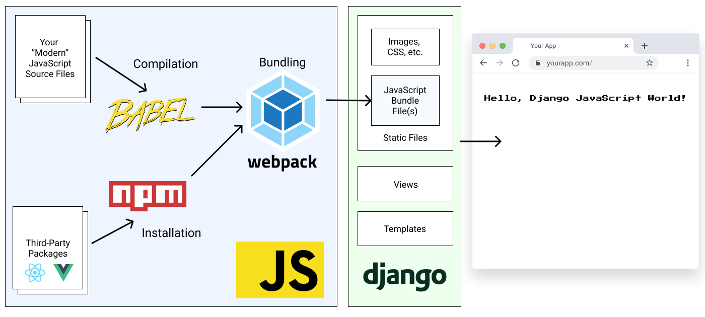

The Front End 
======================

## Architecture

Pegasus's front-end architecture is a hybrid model, with a standalone front-end codebase
that is compiled and served inside Django templates.

The front end uses [Babel](https://babeljs.io/) and [Webpack](https://webpack.js.org/) to
compile the front-end code into bundle files that can be referenced using Django's 
static file system, as represented in the diagram below.



Pegasus's styles use either the [Tailwind](https://tailwindcss.com/),  [Bootstrap](https://getbootstrap.com/) or [Bulma](https://bulma.io/) CSS frameworks,
and building the CSS files is included as part of the front-end build pipeline.
For more details on CSS in Pegasus, see the [CSS documentation](/css/).

**For a much more detailed overview of the rationale behind this architecture,
and the details of the set up see the [Modern JavaScript for Django Developers](https://www.saaspegasus.com/guides/modern-javascript-for-django-developers/)
series.**

## Front-end files

The source front-end files live in the `assets` directory, while the compiled files
get created in the `static` directory.

Generally you should only ever edit the front-end files in `assets` directly, 
and compile them using the instructions below.

## Prerequisites to building the front end

To compile the front-end JavaScript and CSS files it's expected that you have installed:

- [Node.js](https://nodejs.org/)
- [NPM](https://docs.npmjs.com/downloading-and-installing-node-js-and-npm)

Pegasus is developed and tested on the latest LTS releases, which (at the time of this writing)
are Node version 16.15.0 and npm 8.5.5
Later versions may work, but aren't well-tested.
Also it's recommended to use [`nvm`](https://github.com/nvm-sh/nvm) to manage different node/npm environments more easily.
`nvm` is essentially `virtualenv` for Node.js/npm.

## Initial setup

Getting started should be as simple as running:

```bash
npm install
```

or in Docker:

```
make npm-install
```

In your project's root directory.
This will install all the dependencies necessary to build the front end.

It will also generate a `package-lock.json` file.
It is recommended that you add this file to source control for consistency across installations.

## Building in Development

Whenever you make modifications to the front-end files you will need to run
the following command to rebuild the compiled JS bundles and CSS files:

```bash
npm run dev
```

You can also set it up to watch for changes by running:

```bash
npm run dev-watch
```

or in Docker:

```
make npm-watch
```

## Building for production

To build for production, run:

```bash
npm run build
```

or in Docker:

```
make npm-build
```

This will compress your files, remove logging statements, etc.

## Long-term best practices

For ease of initial set up, the front-end bundle files are included with the Pegasus codebase.
This allows you to get up and running with Pegasus without having to set up the front-end build pipeline.

However, keeping these files in source control will typically result in a lot of unnecessary changes and merge conflicts.
Instead, it is recommended that you add the compiled CSS and JavaScript bundle files to your `.gitignore`
so they are no longer managed by source control, and have your developers build them locally using the steps above.
**You can switch to this workflow by unchecking the "include static files" option in your project configuration.**

For production deployment, see the [production guidance](deployment/production-checklist.md#optimize-your-front-end) on this.

## Providing site-wide JavaScript

Sometimes you need access to a library or piece of code you've written on many different pages.
Pegasus has a few patterns for dealing with this.

### `site.js` and `app.js`

There are two "site-wide" JavaScript files used in Pegasus.

The `site.js` file contains code that you want loaded *on every page*.
Its bundle file (`site-bundle.js`) is included in your `base.html`.
This is a good place to put global code, library imports, etc. which should always be available.

The `app.js` file contains code that you want loaded *on some pages---typically after login.
This is a good place to put helper functions that are only used in a few places.
The `app-bundle.js` file is *not* included by default, and so must be explicitly added to any page that needs it,
like this:

```html


  <script src=""></script>

```

The distinction between `site` and `app` is somewhat arbitrary---if you wanted you could create page-level
files for every function/module, or dump all your code into `site.js`.
But it's done to balance page speed and complexity.

The more individual JavaScript files you have, the less code will have to be loaded on any individual page.
This should generally make your site faster. But it's more complex to maintain as each new file needs to be
added to your `webpack.config.js`.

Meanwhile, dumping everything in a single file is easier to maintain, but can lead to bulky initial page load times.
After the initial load, the browser's cache should help, so this can be acceptable for most pages
(apart from your landing page / marketing site).

Because of this, Pegasus recommends keeping `site.js` lightweight, and lumping together code after login into `app.js`.
But feel free to do something differently!

### Making an existing package available

To make a library available on every page, you can follow these steps.
Note: there are many ways to do this, but this is the way it's currently handled in Pegasus. 

1. Install the library via `npm install <library>`.
2. Create a javascript file for the library in `assets/javascript`.
3. Expose the library via the library's instructions. E.g. `window.library = require('library')`.
   This step will vary based on the library.
4. Import the library in your `site.js` or `app.js` file (see above for the distinction).
5. Rebuild your front end.

You can see an example with HTMX (version 2023.2 and later) or Alpine.js (version 2023.3 and later).

### Using the SiteJS library

Pegasus uses [webpack libraries](https://webpack.js.org/guides/author-libraries/) to expose helper code.

You can export code in any file. For example in `app.js`:

```
export { Payments } from './payments';
export { Modals } from './web/modals';
```

Then, as long as you import the `app-bundle.js` file (as per above),
you will have all the exported code available via the `SiteJS` library. For example:

```javascript
const modal = SiteJS.app.Modals.initializeModal();
const paymentIntent = SiteJS.app.Payments.createPaymentIntent();
```

The structure for using something will always be:

```javascript
SiteJs.<package-name>
```

Where `<package-name>` is the name of the file in the `module.exports` section of `webpack.config.js`.
You can look at existing Pegasus examples to get a better sense of how this works.

## TypeScript and type checking

Since the 2022.6 release, Pegasus includes TypeScript as part of the front end code.
You can write TypeScript or JavaScript code and it will be transpiled to work in a browser as part of the
build pipeline.

The build pipeline does *not* explicitly do type checking.
To do type checking you can run:

```
npm run type-check
```

Or in Docker:

```
npm run type-check-watch
```

Type checks will also automatically run on new pull requests if you have enabled Github Actions on your project.

## Troubleshooting

### Changes are not being picked when running `make npm-watch` in a Docker container

Some Docker configurations do not properly pick up file-system changes across operating systems.
This can be a problem, e.g. when running on certain Windows environments.
This causes changes made to not be automatically picked up.

This can be fixed by updating `webpack.config.js` to use polling by adding this:

```javascript
module.exports = {
   //...
   watchOptions: {
      poll: 1000,
   },
};
```

Alternatively, you can switch to installing/running NPM natively instead of in Docker.
This is a good option if you are also getting poor performance, which can also be caused
by cross-platform issues.
