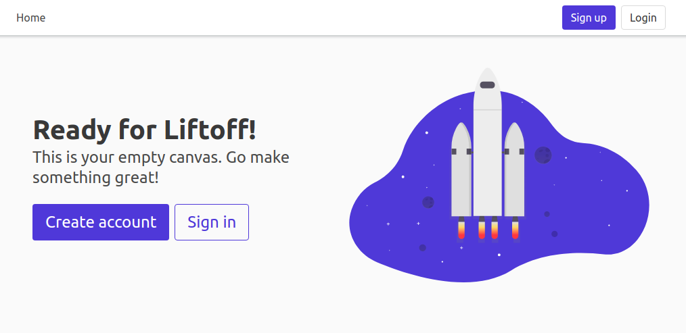

Getting Started
===============

Here's everything you need to start your first Pegasus project.

## Watch the video

<div style="position: relative; padding-bottom: 56.25%; height: 0; overflow: hidden; max-width: 100%; height: auto; margin-bottom: 1em;">
    <iframe src="https://www.youtube.com/embed/mod5WwUWOZw" frameborder="0" allowfullscreen style="position: absolute; top: 0; left: 0; width: 100%; height: 100%;"></iframe>
</div>

Visual learner? The above video should get you going.
Else read on below for the play-by-play.

## Create and download your project codebase

If you haven't already, you'll need to [purchase a Pegasus License on saaspegasus.com](http://www.saaspegasus.com/licenses/).

Then, [create a new project on saaspegasus.com](https://www.saaspegasus.com/projects/),
following the prompts and filling in whatever configuration options you want to use for your new project.
Make sure that the "license" field at the bottom is set.

Once you're done, download your project's source code as a zip file.
Unzip it to a folder where you want to do your development and you're ready to go!

## Set up source control

It is highly recommended to use git for source control.
[Install git](https://git-scm.com/downloads) and then run the following commands:

```
git init
git add .
git commit -am "initial project creation"
```

It is also recommended to create a `pegasus` branch at this time for future upgrades.

```
git branch pegasus
```

You can read [more about upgrading here](/upgrading).

## Get up and running with Docker

If you've chosen to use Docker in development (the quickest way to get up and running),
continue to the [Docker instructions](/docker).

Then skip ahead to the [post-install steps](#post-installation-steps).


## Get up and running with native Python

Follow these instructions to run your application in your system's Python.

### Install Prerequisites

If you haven't already, you'll need to install the following.

- [Python 3.8 or higher](https://www.python.org/downloads/) (Python 3.9 is recommended)
- [Virtualenv](https://virtualenv.pypa.io/en/stable/)

*Note: It is possible to use the template without `virtualenv`, 
but it is highly recommended, and these instructions assume you are using it.*

If you're using Postgres, you'll also want to make sure [you have it installed](https://www.postgresql.org/download/).

### Setup a Python 3.8+ virtualenv

See [Using Virtual Environments](/using-virtualenvs/) for details on this process.

### Enter the project directory

```
cd {{ project_name }}
```

You should see a lot of newly created files for your project including a `manage.py` file.

### Install package requirements

```
pip install -r requirements.txt
```

Note: if you have issues installing `psycopg2`, try installing the dependencies outlined in 
[this thread](https://stackoverflow.com/questions/22938679/error-trying-to-install-postgres-for-python-psycopg2) 
(specifically `python3-dev` and `libpq-dev`.

On Macs you may also need to follow the instructions from [this thread](https://stackoverflow.com/a/58722268/8207). And specifically, run:

```
brew reinstall openssl
export LIBRARY_PATH=$LIBRARY_PATH:/usr/local/opt/openssl/lib/
```

### Set up database (Postgres only)

If you installed with Postgres, edit the `DATABASES` value in `{{ project_name }}/settings.py` with
the appropriate details.

You will also need to create a database for your project if you haven't already:

```bash
sudo -u postgres createdb {{ project_name }}
```

### Create database migrations

```bash
python ./manage.py makemigrations
```

### Run database migrations

```bash
python ./manage.py migrate
```

### Run server

```bash
python ./manage.py runserver
```

Go to [http://localhost:8000](http://localhost:8000) and you should see the default Pegasus landing page!



## Post-installation steps

Once up and running, you'll want to review these common next-steps.

### Create a User

To create your first user account, just go through the sign up flow in your web browser.

From there you should be able to access all built-in functionality and examples.

### Enable admin access

Follow [these instructions](cookbooks#use-the-django-admin-ui) to enable access to the Django Admin site.

### Set up your Stripe Subscriptions

If you've installed with subscriptions, you'll want to set things up next.

Head to the [subscriptions documentation](/subscriptions) and follow the steps there!

### Set up Background Tasks

For the progress bar example to work---and to run background tasks of your own---you'll need a Celery environment running.

Head to [celery](/celery) and follow the steps there!

## Building Your Application

At this point, Pegasus has installed scaffolding for all of the user management, authentication, and (optionally) 
team views and Stripe subscriptions, and given you a beautiful base UI template and clear code 
structure to work from. 
 
Now that you're up and running it's time for the fun part: building your new application!

The can obviously be done however you like.
Some examples of things you might want to do next include:

- Customize your landing page and setup a pricing page
- Start modifying the list of navigation tabs and logged-in user experience
- Create a new django app and begin building out your data models in `models.py`

For some initial pointers on where to to make Pegasus your own, head on over to the 
[Customizations Page](/customizations).

For the nitty-gritty details on setting up things like email, error logging, sign up flow, analytics, and more 
go to [Settings and Configuration](/configuration).
