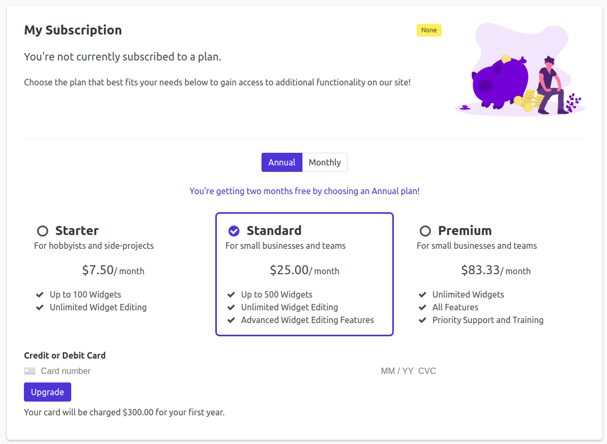

Subscriptions
=============

## Overview

Subscriptions in Pegasus have three components which must all be setup in order for them to work correctly.

1. **Stripe Billing data**. This is configured in Stripe.
2. **Local Stripe models**. These are synced automatically from Stripe to your local database, using
   [`dj-stripe`](https://github.com/dj-stripe/dj-stripe).
3. **Pegasus metadata**. This is configured in `apps/subscriptions/metadata.py` and used to augment
   the data from Stripe.

The easiest way to set up all three is to follow the guide below.

## Getting Started

Complete the following steps in order to set up your first subscription workflow.

### Choose your billing setup

If you haven't already, [set up Pegasus and create an account](/getting-started).
In your project settings you will see several options related to subscriptions.


The first option is your *billing model*. Most projects should choose *standard*,
which lets you create multiple plans with different monthly or annual prices.
Choose *per unit* if you want to charge a variable cost based on the number of units used,
for example, if you want to charge for every team-member.
[Metered billing](https://stripe.com/docs/billing/subscriptions/usage-based), while not officially supported
is largely compatible with the standard model.

The second option is your *pricing UI*. If you're on a standard model or metered billing,
it's recommended to use Stripe's [embedded pricing table](https://stripe.com/docs/payments/checkout/pricing-table).
If you're using per-unit billing, it's recommended to choose "managed by your application".

If all of this is intimidating, don't worry! You can always change these things later.
If you're unsure what you want to use, it is recommended to choose "standard" and "embedded pricing table" to start,
as that is the simplest setup and works well for most projects.

### Set up your billing model in Stripe

Before setting up your development environment for subscriptions, you'll need to create
your billing model in Stripe. You should do this in a test account for development.
You'll eventually be able to copy everything to production once you're happy with the set up.

[Stripe's documentation](https://stripe.com/docs/billing/subscriptions/build-subscriptions?ui=checkout#create-pricing-model)
has guidance on doing this. At a minimum you should create at least one product with a "recurring" price.
If you want to offer multiple pricing plans, create one product for each plan.
If you want to offer both monthly and annual pricing, make sure every product you add includes
both a "monthly" and a "yearly" price.

If you are using the Stripe embedded pricing table, you may also want to add product
descriptions and [features](https://stripe.com/docs/payments/checkout/pricing-table#product-features),
as these will be used on your pricing page.

If you are using the Stripe embedded pricing table, you should also set it up now,
following the [Stripe pricing table documentation](https://stripe.com/docs/payments/checkout/pricing-table).


### Set up your development environment

Once you've created your billing model on Stripe, follow these instructions to set up your development environment.

1. Update the `STRIPE_*` variables in your project's [`.env` file](configuration.md#settings-and-environment-files)
   to match the keys from Stripe. See [this page](https://stripe.com/docs/keys) to find your API keys.
2. Run `./manage.py bootstrap_subscriptions`. If things are set up correctly,
   you should see output that includes information about each product / price that you created,
   and an output starting with `ACTIVE_PRODUCTS = ` containing the products you just created.
   This step will also automatically update your API keys in the Django admin, as
   described in [dj-stripe's instructions](https://dj-stripe.dev/api_keys/#adding-new-api-keys).
3. Next, if you are *not* using the Stripe embedded pricing table:
   1. Paste the `ACTIVE_PRODUCTS` output from the previous step into `apps/subscriptions/metadata.py`
      overriding what is there. Update any other details you want, for example,
      the "description" and "features" fields.
   2. Optionally edit the `ACTIVE_PLAN_INTERVALS` variable in `apps/subscriptions/metadata.py`
      if you don't plan to include both monthly and annual offerings.
4. Alternatively, if you *are* using the Stripe embedded pricing table:
   1. Set the `STRIPE_PRICING_TABLE_ID` variable in your settings/environment to the pricing table ID you created in Stripe.

Now login and click the "Subscription" tab in the navigation. 
If you've set things up correctly you should see a page that looks like this
(it will look slightly different if you are using the Stripe pricing table, or a different CSS framework):



## Configuring the pricing table

### Using the embedded Stripe pricing table

If you are using the Stripe embedded pricing table, then all customization happens within the Stripe dashboard.
You can change the products, names, descriptions, images, and features by editing the products in Stripe with the desired changes.
You can also change the color scheme and other options.

After setting up your pricing table, you should add a custom confirmation URL for each product.
This tells Stripe to return to your application to properly process the subscription after it is purchased.

To do this, edit your pricing table, and under "Payment settings" change the confirmation page setting to
"Don't show confirmation page (Redirect customers to your website.)".
It should look like this:


In the URL box, put the following address for (for development), leaving `{CHECKOUT_SESSION_ID}` exactly like it is written:

```
http://localhost:8000/subscriptions/confirm/?session_id={CHECKOUT_SESSION_ID}
```

In production, enable https, and replace `localhost:8000` with the url of our site.
E.g.

```
https://<yoursite>/subscriptions/confirm/?session_id={CHECKOUT_SESSION_ID}
```

*Make sure you check the option to apply this change to all prices* if you're using monthly and annual pricing.
And then *repeat this process for every product in the pricing page*.

**If you don't make this change, you will not see subscriptions updated unless you are also running webhooks.** 

### Using the in-app pricing table

If you are using the in-app pricing table, your pricing table configuration is handled in `metadata.py`.
You can modify `ACTIVE_PRODUCTS` and `ACTIVE_PLAN_INTERVALS` and see how the page changes.

Whenever you make changes in Stripe, you will need to re-run `./manage.py bootstrap_subscriptions`,
and incorporate any necessary changes into the `ACTIVE_PRODUCTS` list.

More background and details on this set up can be found in this 
[Django Stripe Integration Guide](https://www.saaspegasus.com/guides/django-stripe-integrate/).

## Customer Portal

Pegasus uses the [Stripe Billing Customer Portal](https://stripe.com/docs/billing/subscriptions/customer-portal)
for subscription management after subscription creation.

To set up the portal, it's recommended you follow along with [Stripe's integration guide](https://stripe.com/docs/billing/subscriptions/integrating-customer-portal).

To use the portal you will also need to set up webhooks as per below.

Pegasus ships with webhooks to handle some common actions taken in the billing portal, including:

- Subscription upgrades and downgrades
- Subscription cancellation (immediately)
- Subscription cancellations (end of billing period)

In the Stripe dashboard, you will need to subscribe to a minimum of `customer.subscription.updated`
and `customer.subscription.deleted` to ensure subscription changes through the portal make it to your app successfully.

Payment method updates are coming in a future release.

## Webhooks

Webhooks are used to notify your app about events that happen in Stripe, e.g. failed payments.
More information can be found in [Stripe's webhook documentation](https://stripe.com/docs/webhooks).

Pegasus ships with webhook functionality ready to go, including default handling of many events
taken in Stripe's checkout and billing portals. That said, you are strongly encouraged
to test locally using [Stripe's excellent guide](https://stripe.com/docs/webhooks/test).

### Webhooks in development

In development the easiest way to set up webhooks is to install the [Stripe CLI](https://stripe.com/docs/stripe-cli),
and then run it with the following command:

```
stripe listen --forward-to localhost:8000/stripe/webhook/
```

If you'd prefer, you can also do this with Docker (no Stripe install required) by running:

```
docker run --network host --rm -it stripe/stripe-cli listen --forward-to  localhost:8000/stripe/webhook/  --api-key sk_test_<your_key>
```

**Make sure to set `DJSTRIPE_WEBHOOK_SECRET` in your `settings.py` or environment.**
This value will be in the console output in the Stripe CLI.

### Webhooks in production

To set up webhooks in production:

- Navigate to this page [Webhooks](https://dashboard.stripe.com/webhooks) (assuming you're logged into Stripe).
- Toggle off test mode in the top right corner.
- Click on `Add endpoint`.
- In the `Endpoint URL` field, enter the following URL, replacing `yourserver.com` with your server's domain name. Note: **the trailing slash is required.**
  - `https://yourserver.com/stripe/webhook/`
- Click on `Select Events to Listen To`.
- Search for `checkout.session.completed`, `customer.subscription.updated`, and `customer.subscription.deleted`, and select them. These events are connected by default (see `apps/subscriptions/webhooks.py` for the source code). You can add other webhooks as well, but these are the minimum set required for subscriptions and the billing portal to work properly.
- Write a description if needed and then click `Add endpoint`.
- **Ensure to set `DJSTRIPE_WEBHOOK_SECRET` in your `settings.py` or as an environment variable.**
  This value can be found in the Stripe dashboard where you configure your webhook and may be referred to as the `Signing Secret`.

In production, you should not need to run `stripe listen --forward-to localhost:8000/stripe/webhook/` (or the Docker equivalent).

Once webhooks are properly set up, all underlying Stripe data will be automatically synced from Stripe with no additional setup required on your part.

### Custom Webhook Handling

You may want to do more than just update the underlying Stripe objects when processing webhooks, 
for example, notifying a customer or admin of a failed payment.

Pegasus ships with an example of executing custom logic from a webhook in `apps/subscriptions/webhooks.py`. 
This basic example will mail your project admins when a Subscription is canceled.

More details on custom webhooks can be found in the [dj-stripe documentation](https://dj-stripe.readthedocs.io/en/stable/usage/webhooks.html).

## Supporting multiple currencies

If you use Stripe's embedded pricing table you get multi-currency support out of the box.
Follow [the Stripe guide](https://stripe.com/docs/payments/checkout/present-local-currencies?platform=multi-currency-prices)
to set your products and prices up for multiple currencies.

If you use an in-app pricing table, Stripe will still present your prices to customers
in local currencies, but the pricing table itself will display the prices in your default currency.

## Free trials

You can easily enable free trials using the option in Stripe's embedded pricing table.
Your customers will be able to sign up with their credit cards for a trial and will have the same 
experience in your application as someone who is paying for the plan.
They'll be able to update their status from the customer portal, and once the trial period ends they will be billed.

If you're using trials you must set up webhooks to be notified whether the customer subscribes or cancels
at the end of their trial.

It is also possible to use free trials without the embedded pricing table.
To do so, you need to add a `trial_end` or `trial_period_days` value to the `subscription_data`
in `create_stripe_checkout_session`, as described in [the Stripe documentation](https://stripe.com/docs/billing/subscriptions/trials).

## Feature-Gating

Pegasus ships with a demo page with a few feature-gating examples, which
are available from a new Pegasus installation under the "Subscription Demo" tab.

These include:

1. Changing content on a page based on the user/team's subscription.
1. Restricting access to an entire page based on the user/team's subscription.
1. Showing subscription details like plan, payment details, and renewal date.

(using-the-active-subscription-required-decorator)=
### Using the `active_subscription_required` decorator

One common use-case is restricting access to a page based on the user's subscription.

Pegasus ships with a decorator that allows you to do this.
You can use it as follows:

```python
@login_required
@active_subscription_required
def subscription_gated_page(request, subscription_holder=None):
    return TemplateResponse(request, 'subscriptions/subscription_gated_page.html')
```

If the user doesn't have an active subscription, they'll be redirected to the subscription page to upgrade.

You can also restrict access based on a specific plan (or set of plans), as follows:

```python
@login_required
@active_subscription_required(limit_to_plans=["pro", "enterprise"])
def subscription_gated_page(request, subscription_holder=None):
    return TemplateResponse(request, 'subscriptions/subscription_gated_page.html')
```

In this case the user will only be allowed to view the page if they have a pro or enterprise plan.

### Using the `get_feature_gate_check` helper function

For more fine-grained control you can use the `get_feature_gate_check` helper function.
This takes in two arguments, the `subscription_holder` (usually a User or Team), and optionally the same
`limit_to_plans` list above, and returns a `FeatureGateCheckResult`, which includes whether the
check passed (subscription holder has a subscription of the right type), and an optional message
explaining the answer.

Example usage:

```python
from apps.subscriptions.feature_gating import get_feature_gate_check


def my_view(request):
    check_result = get_feature_gate_check(request.team, ["professional"])
    if check_result.passed:
        do_actions_pro_only()
    else:
        logging.info(f"Pro actions skipped: {check_result.message}")
```

## Per-Unit / Per-Seat Billing

Pegasus supports per-unit / per-seat billing.
Choose this option when building your project to enable it.
**It is not recommended to use the Stripe embedded pricing table if you are using per-unit billing.**

For Team-based builds the default unit is Team members.
For non-Team builds you will have to implement your own definition of what to use for billing quantities.

Here is [a short video walkthrough of this feature](https://youtu.be/v_ayMEj924w).

### Choosing your billing model

Refer to the [Stripe documentation](https://stripe.com/docs/products-prices/pricing-models) for how to set this up in your Price model.
You can use any of:

- Standard pricing (e.g. $10/user)
- Package pricing (e.g. $50 / 5 new users)
- Tiered pricing (graduated or volume) (e.g. $50 for up to 5 users, $5/user after that) 

### Displaying prices on the subscriptions page

For per-unit billing you can no longer display a single upgrade price since it is dependent on the number of units.

To avoid displaying an "unknown" price when showing the subscription, you can add a `price_displays` field to
your `ProductMetadata` objects that takes the following format:

```python
ProductMetadata(
    stripe_id='<stripe id>',
    name=_('Graduated Pricing'),
    description='A Graduated Pricing plan',
    price_displays={
        PlanInterval.month: 'From $10 per user',
        PlanInterval.year: 'From $100 per user',
    }
),
```

This will show "From $10 per user" or "From $100 per user" when the monthly or annual plan is selected, respectively.

#### Per-seat pricing and the embedded pricing table.

**Though it is possible to use the pricing table with per-seat billing, it is not recommended.**

This is because Stripe does not allow you to pass per-seat quantities with the Pricing Table, so if you use the pricing table
with per-seat pricing, your users will be able to choose the number of "seats" (quantity) when they check out.

This is different from the expected behavior, which is that your app sets the quantity explicitly based on
the number of team members (or your own business logic, for user-based builds).
Since Pegasus is set up to automatically update the subscription quantity based on the "usage" in your application,
this could result in your users buying a certain number of seats, and then unexpectedly having the price change
to the amount they are actually using.

You can disable Pegasus automatically updating the per-seat quantity, and then modify your application's
business logic to be based off the "quantity" property of the user/team's subscription, though this is not
an officially supported workflow.


### Keeping your Stripe data up to date

When changes are made that impact a user's pricing, you will need to notify Stripe of the change.
This should happen automatically every 24 hours as long as you have enabled celery and celerybeat.
You can also trigger it manually via a management command `./manage.py djstripe_sync_models subscription`.

To ensure this command works properly, you must implement two pieces of business logic:

1. You must update the billing model's `billing_details_last_changed` field any time the number of units has change.
2. You must override the `get_quantity` function on your billing model to tell Stripe how many units it contains.

**If you use Teams with per-seat billing this will be automatically handled for you by default.**
All you have to do is run the management command or connect it to a periodic task.

For User-based, or more complex billing models with Teams you will have to implement these changes yourself.

#### A User-based example

Here's a quick example of how you might do this with User-based billing.

Let's say your app allows users to define workspaces and they are billed based on the number of workspaces they create.

You might have a workspace model that looks like this:

```python
class Workspace(models.Model):
    user = models.ForeignKey(settings.AUTH_USER_MODEL, on_delete=models.CASCADE, related_name='workspaces')
    # other workspace fields here
```

Then you would want to update the `billing_details_last_changed` field of the `CustomUser` object every time a workspace
was added or removed (step 1, above). That might look something like this, using [Django signals](https://docs.djangoproject.com/en/4.0/topics/signals/):

```python
@receiver(post_save, sender=Workspace)
def update_billing_date_on_workspace_creation(sender, instance, created, **kwargs):
    if created:
        instance.user.billing_details_last_changed = timezone.now()
        instance.user.save()


@receiver(post_delete, sender=Workspace)
def update_billing_date_on_workspace_deletion(sender, instance, **kwargs):
    instance.user.billing_details_last_changed = timezone.now()
    instance.user.save()
```

The other piece of code you would need to add is associating the `get_quantity` function on the user with the number of 
workspaces they have.

You'd want to add a method like this to `CustomUser`:

```python
class CustomUser(SubscriptionModelBase, AbstractUser):
    # other stuff here
    
    def get_quantity(self):
        return self.workspaces.count()
```

## Stripe in Production

In development you will use your Stripe test account, but when it comes time to go to production,
you will want to switch to the live account.

This entails:

1. Setting `STRIPE_LIVE_MODE` to `True` in your settings/environment.
2. Populating `STRIPE_LIVE_PUBLIC_KEY` and `STRIPE_LIVE_SECRET_KEY` in your environment.
3. Updating your `ACTIVE_PRODUCTS` to support both test and live mode (see below)

### Managing Test and Live Stripe Products

When you run `bootstrap_subscriptions` Pegasus will generate a list of your `ACTIVE_PRODUCTS` that includes
hard-coded Stripe Product IDs.
This works great in development, but presents a problem when trying to enable live mode.

One way to workaround this is to replace the hard-coded product IDs with values from your django settings.

E.g. in `apps/subscriptions/metadata.py` change from:

```python
ACTIVE_PRODUCTS = [
    ProductMetadata(
        stripe_id='prod_abc',  # change this line for every product
        slug='starter',
        ...
```

To:

```python
ACTIVE_PRODUCTS = [
    ProductMetadata(
        stripe_id=settings.STRIPE_PRICE_STARTER,  # to something like this
        slug='starter',
        ...
```

Then in your `settings.py` file, you can define these values based on the `STRIPE_LIVE_MODE` setting:

```python
STRIPE_LIVE_MODE = env.bool("STRIPE_LIVE_MODE", False)

STRIPE_PRICE_STARTER = "prod_xyz" if STRIPE_LIVE_MODE else "prod_abc"
```

You will have to do this for each of your products.

## Troubleshooting

**Stripe is not returning to the right site after accessing checkout or the billing portal.**

There are two settings that determine how Stripe will call back to your site.

If Stripe is returning to the *wrong site entirely* it is likely a problem with your Django `Site` configuration.
See the documentation on [absolute URLs](configuration.md#absolute-urls) to fix this.

If Stripe is returning to the correct site, *but over HTTP instead of HTTPS* (or vice versa) then you
need to change the `USE_HTTPS_IN_ABSOLUTE_URLS` setting in `settings.py` or a production settings file.

**Subscriptions are not being created in your app when using the embedded pricing table.**

Make sure that you have updated the confirmation page for every product and every price
to `https://<yoursite>/subscriptions/confirm/?session_id={CHECKOUT_SESSION_ID}` as described above.

You can also turn on webhooks to fix this, though it's recommended to use the custom confirmation page
to provide a better user experience.

**Stripe webhooks are failing with a signature error.**

If you get an error like "No signatures found matching the expected signature for payload" or similar there are a few things to check:

First, double check all of your API keys and secrets in your environment/settings files. These are:

- `STRIPE_LIVE_PUBLIC_KEY` and `STRIPE_LIVE_SECRET_KEY` (for live mode), or `STRIPE_TEST_PUBLIC_KEY` and `STRIPE_TEST_SECRET_KEY` (for test mode)
- `STRIPE_LIVE_MODE` should match whether you're in live / test mode.
- `DJSTRIPE_WEBHOOK_SECRET` should match the secret from the Stripe dashboard.

If you have confirmed these are correct, also double check that you are on the *latest Stripe API version*.
As of the time of this writing, that is 2022-08-01. Your API version can be found in the "Developers" section
of the Stripe dashboard.
